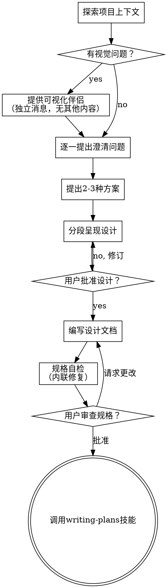

# Brainstorming 需求分析技能

将用户想法转化为完整设计文档的苏格拉底式对话流程。

**硬性门槛 (HARD-GATE)**：在呈现设计并获得用户批准前，不得调用任何实现技能、编写任何代码、创建任何项目骨架或采取任何实现行动。这适用于每个项目，无论其简单程度如何。

## 反模式："这个太简单不需要设计"

每个项目都必须经过此流程。即使是待办事项列表、单函数工具或配置更改。"简单"项目往往是未经审查的假设导致最多浪费工作的来源。设计可以简短（对于真正简单的项目几句话即可），但你必须呈现它并获得批准。

## 检查清单

你必须为以下每个项目创建任务并按顺序完成：

1. **探索项目上下文** — 检查文件、文档、最近提交
2. **提供可视化伴侣**（如果主题涉及视觉问题）— 这是独立的消息，不与其他内容组合
3. **逐一提出澄清问题** — 理解目的/约束/成功标准
4. **提出2-3种方案** — 包含权衡分析和推荐
5. **分段呈现设计** — 按复杂性缩放，逐段获得批准
6. **编写设计文档** — 保存到 `docs/superpowers/specs/YYYY-MM-DD-<topic>-design.md` 并提交
7. **规格自检** — 内联检查占位符、矛盾、歧义、范围（见下文）
8. **用户审查书面规格** — 请用户审查规格文件
9. **转向实现** — 调用 `writing-plans` 技能创建实现计划

## 流程图



**最终状态是调用 `writing-plans`**。不要调用其他实现技能。

## 详细流程

### 1. 探索项目上下文
在询问任何问题之前，先了解当前状态：
- 检查现有文件结构
- 阅读相关文档和README
- 查看最近的提交历史
- 理解技术栈和架构模式

### 2. 提供可视化伴侣（如适用）
如果讨论将涉及视觉问题（UI布局、图表、流程图等）：
- 创建一个独立消息（不与其他内容组合）
- 提供简单的ASCII图表或描述
- 帮助用户可视化讨论方向

### 3. 逐一提出澄清问题
使用苏格拉底式方法，一次一个问题：
- **目的**：这是要解决什么问题？
- **用户**：谁会使用这个？他们的技术背景如何？
- **约束**：有什么限制？时间、技术、资源？
- **成功标准**：怎么知道成功了？具体指标是什么？
- **边界**：什么不是这个项目的一部分？

### 4. 提出2-3种方案
基于理解，提出不同方案：
- **方案A**：保守方案，基于现有模式
- **方案B**：创新方案，使用新技术或方法
- **方案C**：折中方案，平衡风险和收益

为每个方案提供：
- 优点和缺点
- 实施复杂度
- 推荐理由（如果推荐）

### 5. 分段呈现设计
不要一次性呈现整个设计。根据复杂性分段：
- **简单项目**：1-2个段落
- **中等项目**：2-3个章节
- **复杂项目**：按功能模块分章节

每段呈现后，等待用户批准再继续。

### 6. 编写设计文档
格式：
```markdown
# [项目名称] 设计文档

> 创建日期：YYYY-MM-DD
> 状态：草案/已批准

## 1. 概述
[项目目标和范围]

## 2. 背景
[问题陈述和上下文]

## 3. 设计决策
[关键决策和理由]

## 4. 架构设计
[系统架构、组件、接口]

## 5. 详细设计
[各模块详细设计]

## 6. 实施计划
[阶段划分和优先级]

## 7. 风险和缓解措施
[已识别风险及应对]

## 8. 验收标准
[如何验证成功]
```

### 7. 规格自检
检查以下问题：
- **占位符**：TBD、TODO、"稍后实现"等
- **矛盾**：前后不一致的描述
- **歧义**：模糊不清的表述
- **范围蔓延**：是否超出了讨论范围
- **遗漏**：是否缺少重要部分

### 8. 用户审查
请用户：
1. 阅读完整的规格文件
2. 确认是否准确反映他们的需求
3. 提出任何修改意见

### 9. 转向实现
只有在用户明确批准后，才调用 `writing-plans` 技能。

## 煤矿防治水工程特定考虑

对于煤矿防治水工程项目，额外关注：
1. **法规合规性**：相关国家标准和行业规范
2. **数据来源**：传感器、监测设备、历史数据
3. **用户角色**：矿工、安全员、工程师、管理人员
4. **集成需求**：现有系统、GIS平台、数据库
5. **安全关键性**：水害预警的实时性和可靠性

## 示例对话

用户：我需要一个矿井水位监测预警系统

Agent：我来帮你设计这个系统。首先，让我了解一下现有上下文。
[检查相关文件和文档]

让我问几个问题来理解你的需求：
1. 这个系统主要监测哪些参数？水位、水温、水质？
2. 数据来源是什么？现有传感器还是需要新增？
3. 预警需要多实时？秒级、分钟级、小时级？

[根据回答继续深入]

基于我们的讨论，我建议三种方案：
1. **方案A**：基于现有SCADA系统扩展，风险低但功能有限
2. **方案B**：新建微服务架构，灵活但复杂度高
3. **方案C**：混合方案，核心功能新建，外围集成现有系统

我推荐方案C，因为...

现在我来分段呈现设计：
**第一部分：数据采集层**
[详细描述数据采集模块]

你觉得这个设计如何？有什么需要调整的吗？

## 注意事项
1. **耐心引导**：用户可能不确定自己想要什么，需要耐心引导
2. **控制范围**：防止范围蔓延，明确项目边界
3. **记录决策**：所有重要决策都要记录在设计文档中
4. **保持灵活**：设计可能需要多次迭代，保持开放态度
